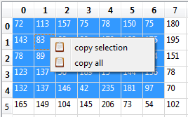

DataObjectTable
-------------------------------------

The designer plugin **DataObjectTable** is used to display a :py:class:`~itom.dataObject` in
an user interface as a table. The displayed content of a dataObject is thereby a shallow copy.
If the read-only property of the table is not set, the user can modify the content which leads
to a direct modification of the values in the origin object. It is not possible to change the
size or type of the displayed dataObject.

.. figure:: dataObjectTable.png    
    :scale: 100%
    :align: center
    
The figure is taken from the example **dataObjectTableDemo** (demo subfolder **ui/customItomWidgets**).
In this example, the **dataObjectTable** widget has the object name **table**. You can then assign an
arbitrary data object to the widget using the following code snippet:

.. code-block:: python
    
    myGui.table["data"] = dataObject.randN([3,4], 'complex64')
    
Vice-versa, the current dataObject is also obtained by the property **data**.

Properties
^^^^^^^^^^^^^^^^^^^^^^^^^^^^^^^^^^

The widget **dataObjectTable** has many options for the parameterization. The entire list can be obtained using the
method :py:meth:`~itom.uiItem.info`. Most properties can be directly changed in the QtDesigner editor. Only the **data**
property is only accessible via the script.

The following properties are often used properties of **dataObjectTable**:

* alternatingRowColors : {bool}
    if true, the background of rows is alternated (e.g. between white and grey)
* readOnly : {bool}
    enable write protection
* min : {float}
    minimum acceptable value (if editing is allowed)
* max : {float}
    maximum acceptable value (if editing is allowed)
* alignment : {enumeration: int or str}
    changes the alignment of the text cells (e.g. "AlignLeft", "AlignCenter", "AlignTop" - see Qt::Alignment)
* verticalResizeMode : {enumeration: int or str}
    defines the mode how the columns can be resized or are stretched over the available space (ResizeToContents, Interactive, Stretch, Fixed, Custom -> see QHeaderView::ResizeMode).
* horizontalResizeMode : {seq. of str} 
    defines the mode how the rows can be resized or are stretched over the available space (ResizeToContents, Interactive, Stretch, Fixed, Custom -> see QHeaderView::ResizeMode).
* suffixes : {seq. of str}
    list with suffixes for each column. If less suffixes than columns are indicated, the last suffix is repeated.
* verticalLabels : {seq. of str}
    list with labels for each shown row (if more rows are shown than labels, a default numbering is used for additional rows)
* horizontalLabels : {seq. of str}
    list with labels for each shown column (if more columns are shown than labels, a default numbering is used for additional columns)
* defaultRows : {int} 
    number of rows to be shown
* defaultCols : {int} 
    number of column to be shown
* editorDecimals : {int} 
    number of possible decimals during the edit of floating point numbers
* decimals : {int}
    number of visible decimals for floating point numbers
* data : {dataObject}
    dataObject that is displaye in the table view

Signals
^^^^^^^^^^^^^^^^^^^^^^^^^^^^^^^^^^

It is possible to connect to various signals emitted from the widget **dataObjectTable**. Most of them are derived
from the base classes and can for instance be requested using the method :py:meth:`~itom.uiItem.info` as member of the
instance of the widget (e.g. **myGui.table.info(1)**). Nevertheless, **dataObjectTable** comes with some specific
signals which can be used:

Besides the default signals from the base classes of the widget **dataObjectTable**, there are some more signals defined:

* pressed(int,int) : signal emitted if a cell if the mouse is pressed on a cell. Arguments are (row,column) of the cell.
* entered(int,int) : signal emitted if a cell is entered by the mouse cursor. Arguments are (row,column) of the cell. Property 'mouseTracking' needs to be enabled for this feature to work.
* doubleClicked(int,int) : signal emitted if a cell is double clicked by the mouse. Arguments are (row,column) of the cell.
* clicked(int,int) : signal emitted if a cell is clicked by the mouse. Arguments are (row,column) of the cell.
* activated(int,int) : signal emitted if a cell is activated. Arguments are (row,column) of the cell.

In the following example, a python method is connected to the clicked signal such that the coordinates of the current cell
all printed to the command line (see also example **dataObjectTableDemo**):

.. code-block:: python 
    
    def cellClicked(row, column):
        print("cell clicked. row:" + str(row) + ", col:" + str(column))
        
    myGui.table.connect("clicked(int,int)", cellClicked)

Copy the table to the clipboard
^^^^^^^^^^^^^^^^^^^^^^^^^^^^^^^^^^

It is possible to copy a subpart or the entire table to the clipboard in a csv-ready format. In order to do this
select a part or the entire table and choose **copy selection** or **copy all** from the context menu (right click
on the table). 

    
The result will look like this (copy selection):

.. code-block:: python
    
    72;113;157;75;78;150;75
    143;83;98;99;170;128;175
    78;89;111;138;73;193;194
    123;137;56;189;15;144;136
    132;137;146;42;235;181;97

