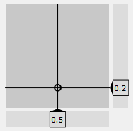

Slider2D
-------------------------------------

The designer plugin **Slider2D** shows a 2D slider panel, where you can choose a x- and y-value using
the mouse. The demo script **slider2DDemo** in the demo subfolder **ui/customItomWidgets** shows an
example. In the example, changes in any position and directly connected to two spin boxes, while changes
in the spin box will call the **setX** or **setY** slot of the Slider2D. These connections are directly
configured in the QtDesigner.

To manually change the x-value or y-value from a script, use the following snippet:

.. code-block:: python

    myGui.slider["xVal"] = 5
    myGui.slider["yVal"] = 10.5

The value of one axis can be bound to a certain min/max value (using the xRange or yRange property). Additionally,
an optional step size value can be adjusted. If it is bigger than zero, the step size based on the minimum value
is automatically considered and values are rounded to the next possible value.

Properties
^^^^^^^^^^^^^^^^^^^^^^^^^^^^^^^^^^

The widget **Slider2D** has many options for the parameterization. The entire list can be obtained using the
method :py:meth:`~itom.uiItem.info`. Most properties can be directly changed in the QtDesigner editor.

The following properties are often used properties of **Slider2D**:

* decimals : {int}
    get/set the number of decimals
* yVal : {float}
    get/set current vertical value (y-value) of the slider
* xVal : {float}
    get/set current horizontal value (x-value) of the slider
* yStepSize : {float}
    get/set the step size of the y-value (default: 0.0, no step size constraints)
* xStepSize : {float}
    get/set the step size of the x-value (default: 0.0, no step size constraints)
* yRange : {seq. of two floats}
    get/set the range of the y-value
* xRange : {seq. of two floats}
    get/set the range of the x-value

Signals
^^^^^^^^^^^^^^^^^^^^^^^^^^^^^^^^^^

It is possible to connect to various signals emitted from the widget **Slider2D**:

* valuesChanged(double,double) : signal is emitted if the hoirzontal and/or vertical value of the slider changed.
* yValChanged(double) : signal is emitted if the y-value of the slider changed.
* xValChanged(double) : signal is emitted if the x-value of the slider changed.
